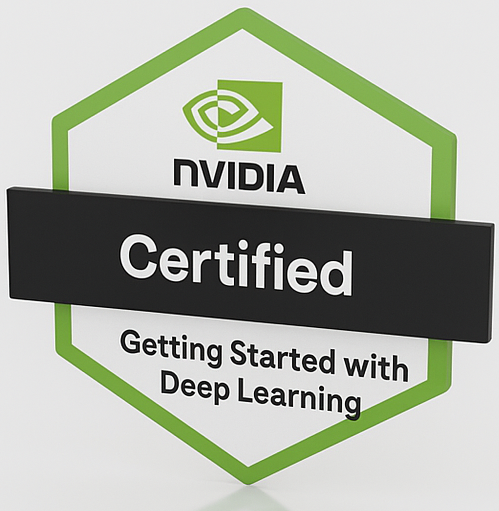
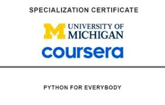

# Hi there, I’m Sudhanshu Kadam 👋  
📊 Turning Data into Insights, Insights into Action!  
**Data Scientist | AI Engineer | Graduate Student @ Arizona State University**

---

## 👨‍🎓 Education
- 🎓 **Master’s in Data Science, Analytics & Engineering (Computational & Decision Analytics)**  
  *Arizona State University, Tempe (2024–2026)* — GPA: **3.89/4.00**  
  Coursework: Data Mining, Data Processing at Scale, Statistical ML, Statistics for Data Analysts, GenAI, Analyzing Big Data, Knowledge Representation, Information Assurance & Security, **Data-Driven Optimization**

- 🎓 **Bachelor’s in Computer Engineering with Minor in Data Science**  
  *SIES Graduate School of Technology, University of Mumbai (2020–2024)* — CGPA: **9.12/10.00**  
  Coursework: Data Science in Healthcare, DBMS, Machine Learning, Probabilistic Graphical Modelling, Quantitative Analysis, Big Data Analytics, Information Retrieval, AI, NLP, Data Warehousing & Mining.

---

## 🚀 Featured Projects

---

## 💻 Tech Stack

  <!-- Languages -->
  &nbsp;
  &nbsp;
  &nbsp;
  &nbsp;
  &nbsp;
  &nbsp;
  
  <!-- ML/DL -->
  &nbsp;
  &nbsp;
  &nbsp;
  &nbsp;
  
  <!-- Big Data / Cloud -->
  &nbsp;
  &nbsp;
  &nbsp;
  &nbsp;
  &nbsp;
  
  <!-- DevOps -->
  &nbsp;
  &nbsp;
  

---
### IDE & Tools

### Languages

### Libraries & ML/DL

### Databases & Cloud

### Big Data & Tools

---

## 📚 Publications
- 📖 [*Personalized Student Engagement Medium Recommendation System*](https://link.springer.com/book/10.1007/978-981-96-3247-3) — ICCCNet 2024, Springer  
- 📖 [*Exploratory Analysis and Geolocation of Data to Help Students Find Housing Facilities*](https://ijisrt.com/exploratory-analysis-and-geolocation-of-data-to-help-student-find-housing-facilities) — IJISRT 2022  

---

## 🏆 Certifications & Trainings (Compact)
<!-- one tight wall, minimal vertical space -->

  <!-- Google -->
  
  <!-- AWS -->
  
  
  
  <!-- NVIDIA -->
  
  
  <!-- IBM -->
  
  <!-- Others -->
  
  
  

---

## 📊 GitHub Stats

  
  
  

---

## 🌐 Connect with Me

  
  
  

---
✨ *Solving real-world problems with intelligent, end-to-end data solutions.*

